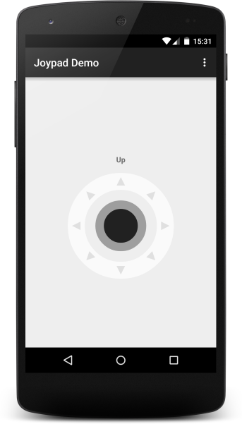
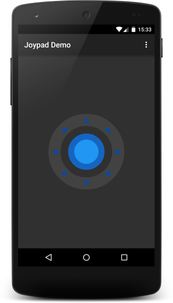

# Joypad View for Android [](https://jitpack.io/#eigenein/joypad-android/)

`Joypad` view simulates a Joystick for interactive applications.

 

## Demo

[](https://play.google.com/store/apps/details?id=ninja.eigenein.joypad.app)

## Examples

* https://github.com/eigenein/rc-car

## Using with Gradle

Add repository to `build.gradle`:

```
repositories {
    // ...
    maven { url "https://jitpack.io" }
}
```

Add the dependency:

```
dependencies {
    compile 'com.github.eigenein:joypad-android:5'
}
```

## Using `JoypadView`

```xml
<ninja.eigenein.joypad.JoypadView
    android:id="@+id/joypad"
    android:layout_width="200dp"
    android:layout_height="200dp"/>
```

When user interacts with `Joypad` then `onUp` and `onMove` events are fired.

```java
final JoypadView joypadView = (JoypadView)view.findViewById(R.id.joypad);
joypadView.setListener(new JoypadView.Listener() {

    @Override
    public void onUp() {
        textView.setText(R.string.text_view_up);
    }

    @Override
    public void onMove(final float distance, final float dx, final float dy) {
        textView.setText(getString(R.string.text_view_move, distance, dx, dy));
    }
});
```

`distance` varies between `0f` and `1f` while `dx` and `dy` vary between `-1f` and `+1f`.

One can configure inner circle color, outer circle color, moveable circle color and direction triangles color:

```xml
<ninja.eigenein.joypad.JoypadView
    android:layout_width="200dp"
    android:layout_height="200dp"
    app:outer_color="@color/grey_800"
    app:moveable_color="@color/blue_500"
    app:directions_color="@color/blue_900"
    app:inner_color="@color/blue_800"/>
```

One can also configure inner circle radius, outer circle width and moveable circle radius by setting `inner_radius`, `outer_width` and `moveable_radius` attributes.

## `WheelsPower`

There is the utility class `WheelsPower` that converts distance and offset into relative power for left and right wheels of some vehicle:

```java
final WheelsPower wheelsPower = WheelsPower.wheelsPower(distance, dx, dy);
// wheelsPower.getLeft() and wheelsPower.getRight() vary from -1 to +1.
```

## License

```
The MIT License (MIT)

Copyright (c) 2015-2017 Pavel Perestoronin

Permission is hereby granted, free of charge, to any person obtaining a copy
of this software and associated documentation files (the "Software"), to deal
in the Software without restriction, including without limitation the rights
to use, copy, modify, merge, publish, distribute, sublicense, and/or sell
copies of the Software, and to permit persons to whom the Software is
furnished to do so, subject to the following conditions:

The above copyright notice and this permission notice shall be included in all
copies or substantial portions of the Software.

THE SOFTWARE IS PROVIDED "AS IS", WITHOUT WARRANTY OF ANY KIND, EXPRESS OR
IMPLIED, INCLUDING BUT NOT LIMITED TO THE WARRANTIES OF MERCHANTABILITY,
FITNESS FOR A PARTICULAR PURPOSE AND NONINFRINGEMENT. IN NO EVENT SHALL THE
AUTHORS OR COPYRIGHT HOLDERS BE LIABLE FOR ANY CLAIM, DAMAGES OR OTHER
LIABILITY, WHETHER IN AN ACTION OF CONTRACT, TORT OR OTHERWISE, ARISING FROM,
OUT OF OR IN CONNECTION WITH THE SOFTWARE OR THE USE OR OTHER DEALINGS IN THE
SOFTWARE.
```
